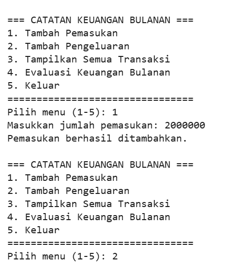
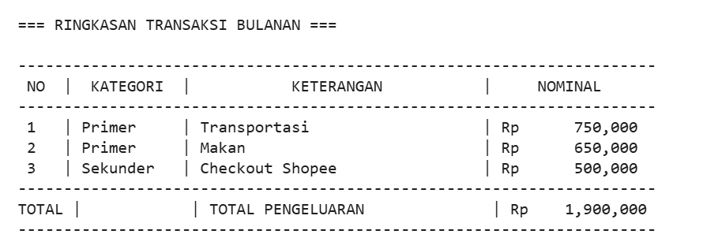
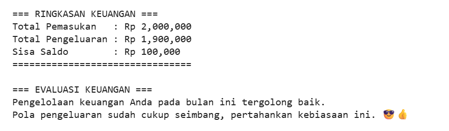
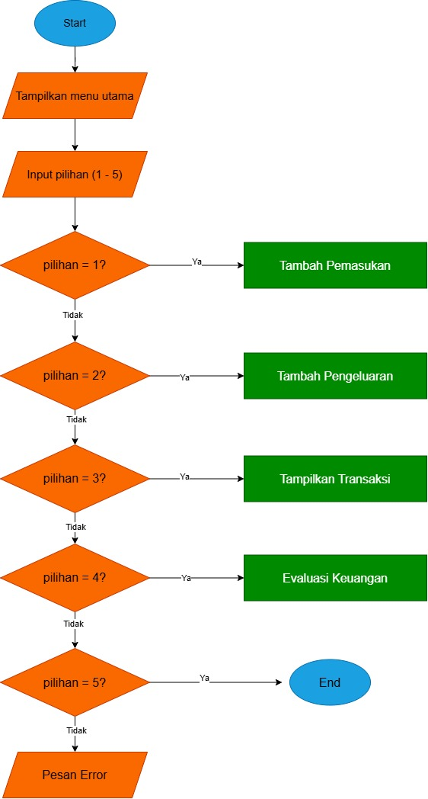

## 🚀 PROGRAM PENCATATAN KEUANGAN BULANAN DENGAN EVALUASI DAN KATEGORI MENGGUNAKAN PYTHON


**TUGAS KELOMPOK**

1. Muhamad Yusuf (25552011061)

2. Muhammad Rafi Musyafa (25552011084)

### 📖 Deskripsi
Program CLI sederhana ini dibuat untuk pengelolaan keuangan bulanan seorang pengguna, khususnya mahasiswa, yang memiliki pemasukan dan pengeluaran dalam satu periode tertentu. Pengguna memasukkan data pemasukan serta data pengeluaran yang dikelompokkan ke dalam tiga kategori, yaitu kebutuhan primer, sekunder, dan tersier.

Program kemudian mengolah data tersebut untuk menghitung total pemasukan, total pengeluaran, dan saldo akhir. Selain itu, program memberikan evaluasi kondisi keuangan berdasarkan perbandingan antara pemasukan dan pengeluaran serta batas persentase pengeluaran yang dianggap wajar.

Dengan adanya studi kasus ini, pengguna dapat mengetahui apakah pengeluaran yang dilakukan masih berada dalam batas yang wajar atau perlu dilakukan perbaikan pada pengelolaan keuangan di bulan berikutnya.


### 🎯 Tujuan Project
Project ini dibuat untuk memenuhi tugas mata kuliah Pengenalan Pemrograman / Latihan logika dasar Python

1. Menerapkan konsep dasar pemrograman Python yang telah dipelajari pada 
semester pertama.
2. Membuat program sederhana untuk mencatat pemasukan dan pengeluaran 
bulanan.
3. Mengelompokkan pengeluaran berdasarkan kategori kebutuhan.
4. Memberikan evaluasi kondisi keuangan pengguna agar dapat mengelola 
keuangan dengan lebih bijak.
5. Melatih kemampuan berpikir logis dan terstruktur dalam menyelesaikan 
permasalahan menggunakan pemrograman.

### Screenshot Output



---
### 🧩 Logika & Algoritma

#### 1. Flowchart
Berikut adalah alur logika program ini:



#### 2. Pseudocode
```text
Mulai

Inisialisasi list transaksi Inisialisasi total_pemasukan = 0

Selama program berjalan: Tampilkan menu utama Input pilihan menu

Jika pilihan = 1:
    Input jumlah pemasukan
    Tambahkan ke total_pemasukan

Jika pilihan = 2:
    Tampilkan pilihan kategori pengeluaran
    Input kategori pengeluaran
    Input keterangan pengeluaran
    Input nominal pengeluaran
    Simpan data pengeluaran ke dalam list transaksi

Jika pilihan = 3:
    Jika transaksi kosong:
        Tampilkan pesan "Belum ada transaksi"
    Jika tidak:
        Tampilkan seluruh data transaksi

Jika pilihan = 4:
    Hitung total pengeluaran
    Hitung total pengeluaran primer
    Hitung total pengeluaran sekunder
    Hitung total pengeluaran tersier
    Hitung saldo akhir

    Tampilkan ringkasan keuangan

    Jika total pengeluaran lebih besar dari total pemasukan:
        Tampilkan peringatan pengeluaran melebihi pemasukan

    Jika pengeluaran sekunder lebih dari 50% pemasukan:
        Tampilkan saran untuk mengurangi pengeluaran sekunder

    Jika pengeluaran tersier lebih dari 25% pemasukan:
        Tampilkan saran untuk membatasi pengeluaran tersier

    Jika pengeluaran masih dalam batas wajar:
        Tampilkan pesan pengelolaan keuangan baik

Jika pilihan = 5:
    Tampilkan pesan keluar
    Hentikan program

Jika pilihan tidak valid:
    Tampilkan pesan kesalahan
Selesai